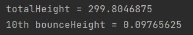
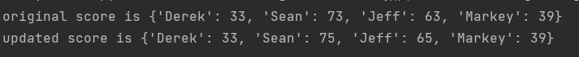

### BallBouncing
Folder path ./logicProgramming/ballBouncing.py is for sheet 3 Q1.  

### UpdateScore
Folder path ./logicProgramming/updateScore.py is for sheet 3 Q2.  

### automation
- Folder path ./automation/homePage.py is for defining home page components 
- Folder path ./automation/creditCardIntroduction.py is for defining credit card introduction page components 
- Folder path ./automation/main.py is for executing automation test 
- Folder path ./automation/utils.py is for defining webdriver actions 
- Folder path ./automation/config.ini is for setup environment 
- Screenshot will save on folder path ./automation/test_result  
